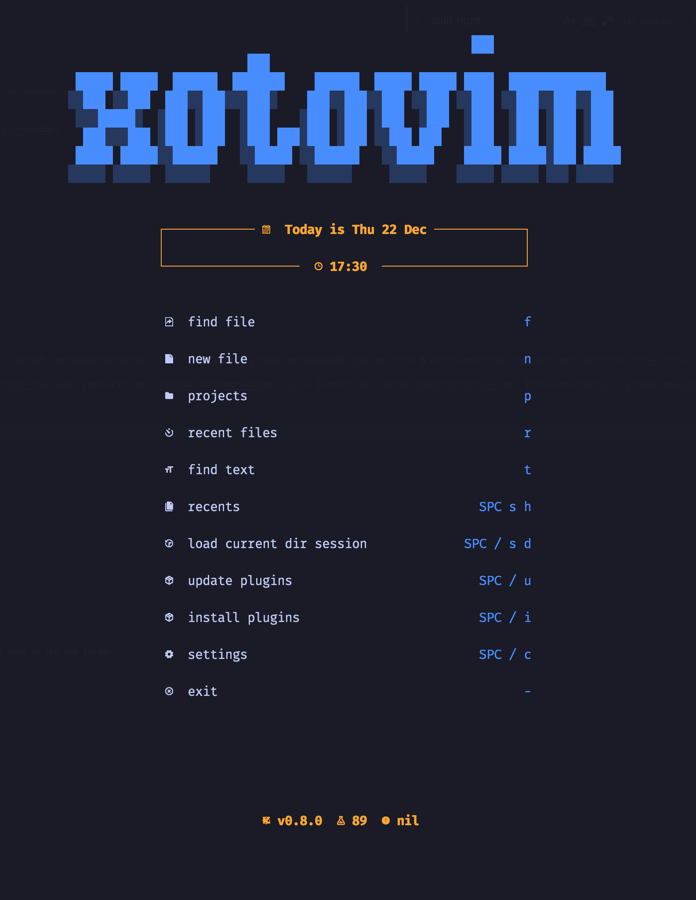

# XotoVim: Neovim Config

[](https://github.com/xotomachine/xotomachine-xotovim/commits/development)


### A non-minimal Neovim config built to work most efficiently with any development

## Features 💠

- Recommended default theme: [Tokyonight](https://github.com/folke/tokyonight.nvim)
- Highly performant even with a lot of plugins
- Lazy loaded
- Extendable LSP configuration
- Support for [TailwindCSS](https://tailwindcss.com/) with highlighted colors
- Support for [Tabnine](https://www.tabnine.com/) and copilot
- JSON autocompletion for most popular Frontend config
- NPM packages autocompletion
- Internal [Jest](https://github.com/facebook/jest) testing
- Treesitter-based folding
- Git management with [Lazygit](https://github.com/jesseduffield/lazygit), custom telescope commits view with [git-delta](https://github.com/dandavison/delta), [gitsigns](https://github.com/lewis6991/gitsigns.nvim) & [diffview](https://github.com/sindrets/diffview.nvim), custom git blame

And of course usage of [telescope](https://github.com/nvim-telescope/telescope.nvim), [nvim-tree](https://github.com/kyazdani42/nvim-tree.lua), [barbar](https://github.com/romgrk/barbar.nvim), [cmp](https://github.com/hrsh7th/nvim-cmp), [treesitter](https://github.com/nvim-treesitter/nvim-treesitter), [blankline](https://github.com/lukas-reineke/indent-blankline.nvim) & more!

## Screenshots 📸

Dashboard



## Installation ⚡️

Copy it into your terminal:

```bash
bash <(curl -s https://raw.githubusercontent.com/xotomachine/xotomachine-xotovim/development/.install/run.sh)
```

After install configuration:

1. Treesitter Languages are <ins>installed</ins> by default.\
   If you wish to add more of them make sure to run `:TSInstall <lang>` for specific language you want to install and configure them in the lsp folder. 
2. LSP servers are enabled by default. You can check installed LSP servers by :Mason command.

## Configuration 💻

To change XotoVim related config use the `config.lua` file.\
To change vim settings use the `settings.lua` file.

## Next list for updates 📝

| Description                                     | Progress                                                           |
|-------------------------------------------------|--------------------------------------------------------------------|
| Create npx auto-installer & uninstaller         |                 |
| Easy user configurable config                   |  |
| Better configuration of additional LSPs         |  |
| Better support for null-ls and local formatting |  |

## Future Todo 🔥

| Description                                            | Progress                                                           |
|--------------------------------------------------------|--------------------------------------------------------------------|
| Project Logo                                           |  |
| Auto resize for more consistent UI behavior            |  |
| Reload in-time support                                 |  |
| Support more LSPs (not only frontend?)                 |  |
| More built-in themes (lazy loaded)                     |  |
| Better UI customization when nvim 0.8 will be in ready |  |

## Done ✅

| Description                                  | Progress                                                       |
|----------------------------------------------|----------------------------------------------------------------|
| Better support to project word refactor      |  |
| Support for nvim-dap debugger for React      |  |
| Support ESLint & Prettier in Native LSP      |  |
| Replace coc-explorer with nvim-tree.lua      |  |
| Replace coc.nvim with Native LSP             |  |
| Change fzf.nvim to telescope.nvim            |  |
| Update statusline to support LSP diagnostics |  |
| Rewrite most config to lua                   |  |
| Support TailwindCSS with colors              |  |
| Provide current screenshots                  |  |
| Create shell installer for Linux & MacOS     |  |
